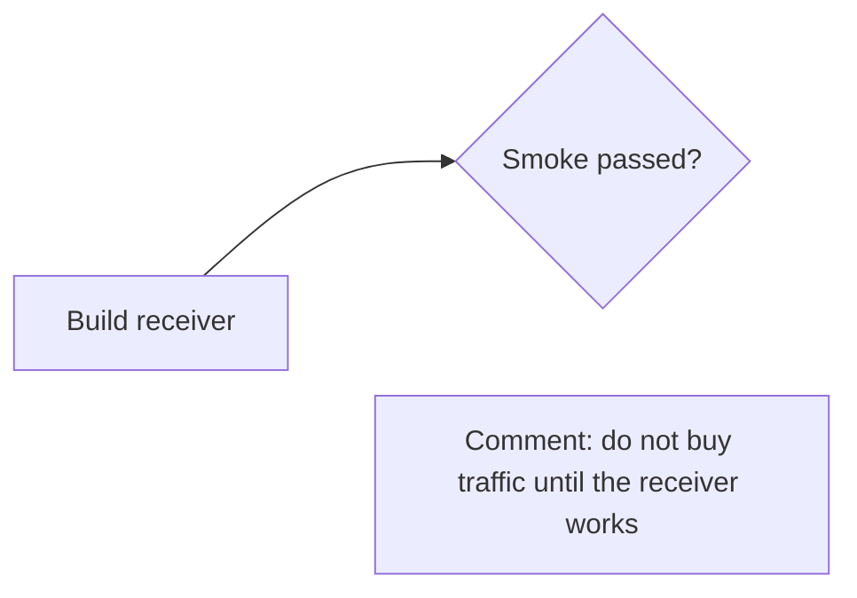
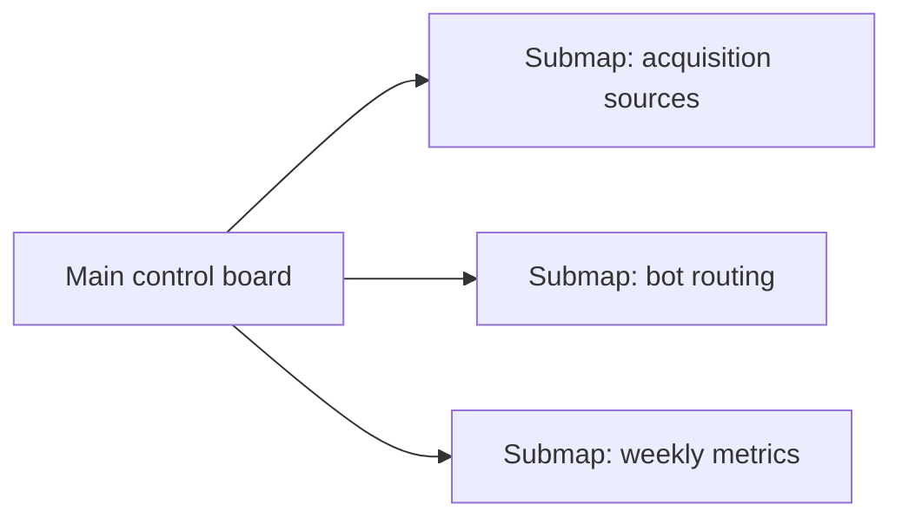

# Mermaid Board Patterns

This reference generalizes the useful parts of the `ai_audit_mermaid_full` board package into template-safe project control rules.

## Source Of Truth

- Store board source as `.mmd`.
- Keep generated PNG/SVG/HTML as exports only.
- Update the `.mmd` before updating a screenshot, FigJam, Excalidraw, or draw.io export.
- Prefer one board per control question instead of one huge all-purpose diagram.

## Useful Board Types

| Board type | Use when | Mermaid type |
| --- | --- | --- |
| Control board | managing current project state, gates, owners, waiting inputs | `flowchart LR` |
| Delivery map | showing phases, dependencies, and stop/go gates | `flowchart LR` or `flowchart TB` |
| Architecture map | showing systems, boundaries, data, interfaces | `flowchart LR` |
| State map | showing bot/app/workflow states | `stateDiagram-v2` or `flowchart TB` |
| Runbook | showing incident or launch steps | `flowchart TB` |
| Timeline | showing dated delivery | `gantt` |

## Control Board Vocabulary

Use visible entities instead of vague boxes:

- `source` - where input or attention comes from.
- `surface` - what a user/stakeholder sees.
- `work` - an action someone can take.
- `gate` - a pass/fail checkpoint.
- `metric` - a number that changes a decision.
- `risk` - a known failure mode.
- `decision` - a fork or keep/kill/change point.
- `waiting` - blocked by missing human input, account access, money, legal approval, or external response.

## Mermaid Style Rules

- Use stable ASCII node IDs: `srcWarm`, `gateSmoke`, `metricStarts`.
- Put human-readable text inside quoted labels: `srcWarm["Warm referrals"]`.
- Keep labels short. Put details in nearby comment cards or the markdown around the board.
- Use semantic `classDef` names. Do not style every node by hand.
- Use a small number of colors. Color means state or category, not decoration.
- Avoid long edge labels. If the edge text is the main content, make it a node.
- Avoid decorative edges from comments. Use proximity or invisible Mermaid links only when layout needs help.

## Comment Cards

Use visible comment cards when the board needs stakeholder explanation:

Comment cards should explain:

- what is happening;
- why this order matters;
- what risk it reduces;
- what input is still missing.

## Split Rules

Split a board when any of these are true:

- more than 35 visible nodes;
- more than 7 lanes;
- a reader must zoom to read labels;
- two different audiences need different detail levels;
- the board mixes current status with long-term architecture.

Main board pattern:

## Viewer UX

- Large boards need a real viewer, not only a static markdown render.
- Required controls: pan, wheel zoom, fit, 1:1, zoom buttons, SVG export, render status.
- Use the project language for visible labels and controls.
- Keep internal Mermaid IDs ASCII even when labels are Russian.
- Prefer SVG `viewBox` pan/zoom so text stays sharp.

## Verification

Preferred checks, in order:

1. Render with project-local Mermaid tooling if available.
2. Render in Mermaid Live Editor, Excalidraw, draw.io, or FigJam if that is the team's board surface.
3. If no renderer is available, do a text check: one diagram header, stable IDs, quoted labels, balanced brackets, no accidental `end` node IDs, and no markdown fences inside `.mmd`.

## Practical Source

This skill was distilled from the local `ai_audit_mermaid_full` package: multi-map `.mmd` source files, submaps, viewer notes, themed export notes, and the OpenDesign-inspired board design system.